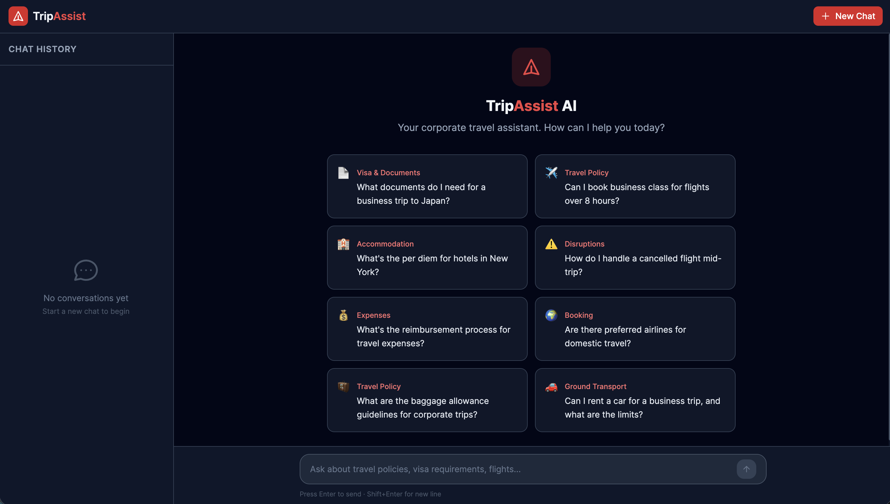
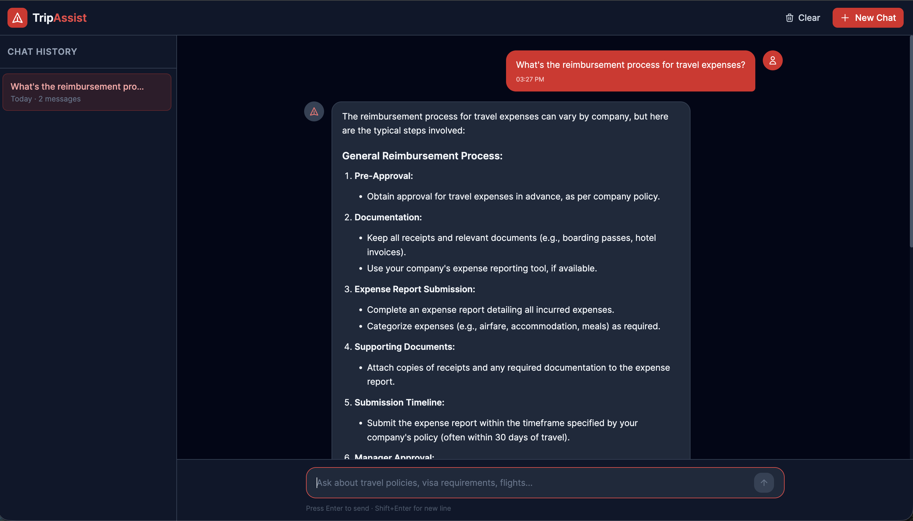

# TripAssist AI — Corporate Travel Assistant

An AI-powered travel assistant that acts as a smart first point of contact for corporate travel questions. Travelers get instant answers without emailing a travel manager or digging through policy docs.

[Working Demo Video](https://drive.google.com/file/d/1wlX8JQ--11pkjH4moJJSEKTJa4aI-Mdc/view?usp=sharing)

## Screenshots





## Problem

Corporate travelers waste hours every week on things that should take seconds — figuring out travel policies, comparing flight options, understanding visa requirements, handling disruptions, and estimating trip costs. There's no intelligent, conversational layer between the traveler and the information they need.

## Who Uses It

- A business traveler checking if their hotel choice is within policy
- An employee flying internationally for the first time asking about visa requirements
- A travel manager who wants to reduce repetitive support queries
- A new hire who doesn't know the company travel rules yet

## Core Features

### 1. Ask Anything Travel-Related
User types a question, AI responds instantly with helpful, accurate travel guidance. Responses render with full markdown formatting (headings, bold, lists, code blocks).

### 2. Suggested Questions on Load
8 pre-built travel prompt cards on the welcome screen so users know what to ask — click any card to send it instantly.

### 3. Conversation Memory
The AI remembers context within the session — follow-up questions like "What about London?" work naturally after asking about New York.

### 4. Chat History
Conversations auto-save to localStorage. Browse past chats in the sidebar, switch between them, or delete individual ones.

### 5. Clear Session
Clear button in the header with a confirmation dialog. Delete individual chats from the sidebar with confirmation.

### 6. Error Handling
- Network errors, API failures, rate limits — every scenario shows a clear message with a Retry button
- Empty input triggers a shake animation
- Input capped at 2000 characters with a visible counter
- Backend validates message format, role, and content length

### 7. Copy & Polish
- Copy button on AI responses (hover to reveal)
- Smooth message entrance animations
- Typing indicator with bouncing dots while AI responds
- Spinner on send button during loading
- Fully responsive — sidebar collapses to hamburger on mobile

## Tech Stack

### Backend
- **Framework:** Flask (Python)
- **AI:** OpenAI API (GPT-4o-mini)
- **CORS:** Flask-CORS
- **Environment:** python-dotenv

### Frontend
- **Framework:** React 18 + Vite + TypeScript
- **Styling:** Tailwind CSS (custom red color theme)
- **HTTP Client:** Axios
- **Markdown:** react-markdown
- **State:** React hooks + localStorage for chat history

## Project Structure

```
spotnana-assessment/
├── backend/
│   ├── app.py                  # Flask app + API routes (/api/health, /api/chat)
│   ├── services/
│   │   └── openai_service.py   # OpenAI client wrapper + system prompt
│   ├── requirements.txt        # Python dependencies
│   ├── .env.example            # Backend env template
│   └── .gitignore
├── frontend/
│   ├── src/
│   │   ├── components/
│   │   │   ├── Layout.tsx          # Main responsive grid layout
│   │   │   ├── Header.tsx          # App header with clear + new chat
│   │   │   ├── Sidebar.tsx         # Chat history sidebar (collapsible)
│   │   │   ├── ChatArea.tsx        # Main chat container
│   │   │   ├── ChatMessages.tsx    # Scrollable message list
│   │   │   ├── MessageBubble.tsx   # Message bubble with markdown + copy
│   │   │   ├── PromptInput.tsx     # Auto-resize input + send button
│   │   │   ├── WelcomeScreen.tsx   # Landing state with suggested prompts
│   │   │   ├── TypingIndicator.tsx # Animated loading dots
│   │   │   ├── ConfirmDialog.tsx   # Accessible confirmation modal
│   │   │   └── ErrorMessage.tsx    # Inline error with retry button
│   │   ├── hooks/
│   │   │   ├── useChat.ts         # Chat state, send, retry logic
│   │   │   └── useChatHistory.ts  # Multi-conversation management
│   │   ├── services/
│   │   │   ├── api.ts             # Axios instance + error parsing
│   │   │   └── storage.ts         # localStorage CRUD with error handling
│   │   ├── types/
│   │   │   └── index.ts           # TypeScript interfaces
│   │   └── data/
│   │       └── suggestedQuestions.ts
│   ├── index.html
│   ├── package.json
│   ├── vite.config.ts
│   └── tailwind.config.js
└── README.md
```

## Getting Started

### Prerequisites

- **Node.js** 18 or higher
- **Python** 3.10 or higher
- **OpenAI API key** — get one at https://platform.openai.com/api-keys

### Step 1: Clone the repository

```bash
git clone https://github.com/dgchovatiya/spotnana-assessment.git
cd spotnana-assessment
```

### Step 2: Set up the backend

```bash
cd backend

# Create and activate virtual environment
python3 -m venv venv
source venv/bin/activate        # On Windows: venv\Scripts\activate

# Install dependencies
pip install -r requirements.txt

# Set up environment variables
cp .env.example .env
```

Open `backend/.env` and add your OpenAI API key:

```
OPENAI_API_KEY=your_api_key_here
FLASK_ENV=development
```

Start the backend:

```bash
python app.py
```

The Flask server starts on **http://localhost:5001**.

### Step 3: Set up the frontend

Open a new terminal:

```bash
cd frontend

# Install dependencies
npm install

# Start the dev server
npm run dev
```

The frontend starts on **http://localhost:5173** and proxies `/api` requests to the backend.

### Step 4: Open the app

Go to **http://localhost:5173** in your browser. Click a suggested question or type your own to start chatting.

## Environment Variables

### Backend (`backend/.env`)

| Variable | Description | Required |
|----------|-------------|----------|
| `OPENAI_API_KEY` | Your OpenAI API key | Yes |
| `FLASK_ENV` | `development` or `production` | No (defaults to production) |

## Design Decisions

- **Red theme** — Custom primary color palette (red-500 to red-950) with dark gray backgrounds for a professional, high-contrast look
- **Mobile-first** — Sidebar collapses to a hamburger menu on small screens, all components adapt to viewport
- **Accessible** — ARIA labels, keyboard navigation (Enter to send, Escape to close dialogs), focus management, screen reader friendly
- **Resilient** — localStorage quota handling, API timeout (60s), input validation on both frontend and backend, graceful error states for every failure scenario

## License

MIT
